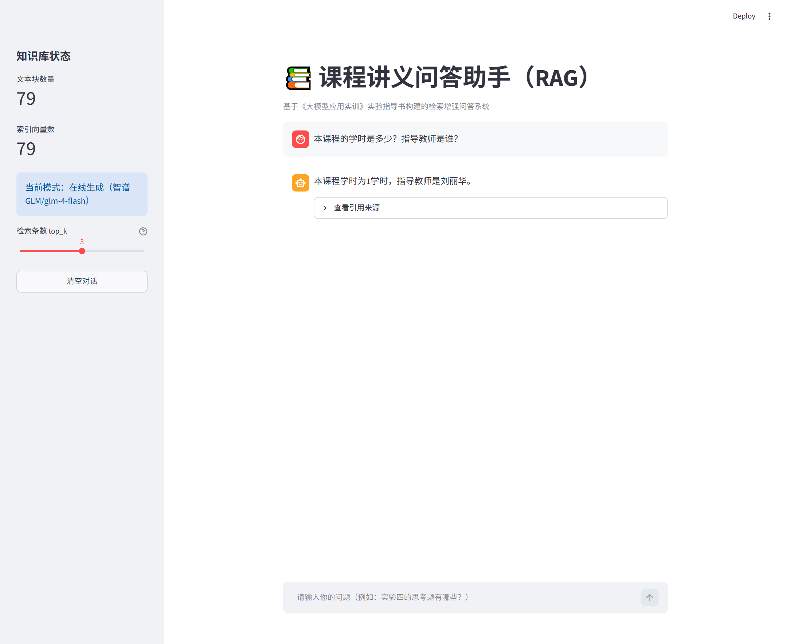
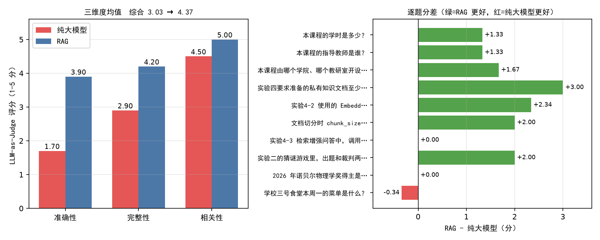

# 课程讲义问答助手（RAG）

> 《大模型应用实训》**实验四：AI 智能体与 RAG 知识库应用开发**
> 基于课程实验指导书构建的检索增强问答系统 —— 只依据私有资料作答，答不出就如实拒答，并给出可核查的引用来源。

**在线体验**：部署后把链接填到这里 → <https://xxx.streamlit.app>（待填）



---

## 一、它解决了什么问题

通用大模型回答"这门课几个学时""实验四要准备多少字的文档"这类**私有知识**问题时，只能凭参数内的模糊记忆编造。本项目把指导书切成片段、向量化后建索引，提问时先检索再作答：

- **答得准**：答案只来自资料，附带引用来源与相似度
- **会拒答**：相似度低于阈值 0.40 时直接说明"资料中没有"，不硬凑
- **可核查**：每条答案都能展开看到它引用了哪几段原文

## 二、技术架构

```
knowledge.txt（20,078 字私有知识文档）
        │  RecursiveCharacterTextSplitter（chunk 300 / overlap 50）
        ▼
   79 个文本块 ──► bge-small-zh-v1.5（512 维，归一化）──► FAISS IndexFlatIP
                                                              │
用户提问 ──► 同一模型向量化（加查询指令前缀）──► Top-K 检索 ──┤
                                                              ▼
                                    相似度 < 0.40 ？──是──► 拒答（不调模型）
                                              │否
                                              ▼
                              拼接 context + 提示词 ──► GLM-4-Flash 生成 ──► 答案 + 引用来源
```

| 组件 | 选型 | 理由 |
|------|------|------|
| 切分 | `RecursiveCharacterTextSplitter` | 按段落→句子递归降级，不拦腰截断章节 |
| Embedding | `BAAI/bge-small-zh-v1.5` | 中文语义检索效果好，仅约 100MB |
| 推理后端 | 本机 PyTorch / 云端 ONNX | 见下方"双后端适配"，实测向量一致性 0.999999 |
| 向量库 | `FAISS IndexFlatIP` | 向量归一化后内积即余弦，精确检索、免训练 |
| 生成 | 智谱 `glm-4-flash` | OpenAI 兼容协议，换供应商只改配置 |
| 前端 | Streamlit | 几十行代码即可做出带引用折叠的对话界面 |

### 双后端适配（为什么云端不装 PyTorch）

`exp4_3_rag.EmbeddedModel` 会按顺序探测可用的嵌入后端：

| 后端 | 依赖 | 用在哪 | 安装体积 |
|------|------|--------|---------|
| `sentence-transformers` | PyTorch | 本机复现实验（报告里的指标由它跑出） | 800MB+ |
| `fastembed` | ONNX Runtime | Streamlit Cloud | ~150MB |

原因是 PyTorch 的 **CPU 版 wheel 只在 `download.pytorch.org` 提供**，而该源在 Streamlit Cloud 上返回
403 Forbidden；PyPI 上的 `torch` 又是数 GB 的 CUDA 版，免费实例装不下。fastembed 跑的是同一个
`BAAI/bge-small-zh-v1.5` 模型（ONNX 形式），**实测两后端向量一致性 0.999999**，检索分数差异在
1e-4 量级（例：0.4898 vs 0.4900），所以拒答阈值 0.40 可以共用。索引按后端分开命名
（`kb.index` / `kb.index.fastembed`），两份都已提交，云端启动零等待。

## 三、目录结构

```
exp4-rag/
├── app.py                 ← Streamlit 入口（云端部署指向它）
├── exp4_3_rag.py          ← 核心：检索 + 拒答阈值 + 生成
├── exp4_1_split.py        ← 文档切分 → chunks.json
├── exp4_2_index.py        ← 向量化 → kb.index
├── exp4_tune.py           ← chunk_size × 指令前缀 调优对照
├── exp4_eval.py           ← 10 题评估（检索层 + 生成层）
├── exp4_5_charts.py       ← 报告图表
├── build_knowledge.py     ← 指导书 docx → knowledge.txt
├── knowledge.txt          ← 私有知识文档（知识库本体）
├── chunks.json            ← 切分产物
├── kb.index               ← PyTorch 后端索引（本机用）
├── kb.index.fastembed     ← ONNX 后端索引（云端用）
├── requirements.txt
└── docs/                  ← 实验报告、源码合集、图表
```

## 四、本地运行

```bash
pip install -r requirements.txt -i https://pypi.tuna.tsinghua.edu.cn/simple

python build_knowledge.py     # 可选：从指导书重新抽取 knowledge.txt
python exp4_1_split.py        # 切分
python exp4_2_index.py        # 建索引
streamlit run app.py          # 打开 http://localhost:8501
```

> 若 `chunks.json` 或 `kb.index` 缺失，程序会**用 knowledge.txt 自动重建**，无需手工执行前两步。

配置密钥（可选，不配也能跑，只是降级为"引用式作答"）：

```bash
# 方式一：环境变量
export ZHIPU_API_KEY=你的密钥

# 方式二：本目录 .env 文件（已 gitignore）
echo "ZHIPU_API_KEY=你的密钥" > .env
```

## 五、部署到 Streamlit Cloud

1. 打开 <https://share.streamlit.io> → **New app**
2. 填写：Repository = `guoweidong11/exp4-rag`，Branch = `main`，**Main file path = `app.py`**
3. 点 **Advanced settings**，务必做两件事：
   - **Python version 选 `3.12`** ← 云端默认是 3.14，太新，faiss / numpy 等还没有对应 wheel，必然装不上
   - **Secrets** 里填：

     ```toml
     ZHIPU_API_KEY = "你的智谱密钥"
     ```

     > 代码里 `_load_streamlit_secrets()` 会自动读取并注入环境变量；
     > 不填也能启动，只是走离线引用模式。
4. 点 Deploy，首次构建约 2–4 分钟

### 部署小贴士

- **Python 版本只能在界面里选**：Streamlit Community Cloud 不读取 `runtime.txt` / `.python-version`。
  已部署的应用可以到 **Manage app → Settings → Advanced** 改，改完点 Reboot
- 依赖里**刻意没有 PyTorch**（原因见"双后端适配"），所以构建很快、不容易失败
- 模型与索引用 `@st.cache_resource` 缓存，只有冷启动加载一次
- HuggingFace 端点自动探测：国内 → hf-mirror，海外 → 官方

## 六、实测结果

| 指标 | 结果 |
|------|------|
| 知识文档规模 | 20,078 字符 / 7,893 汉字（要求 ≥ 5000） |
| 切分块数 | 79 块，平均 253 字 |
| 索引自检 | chunk[2] 自检索相似度 **1.0000** |
| 检索层 Hit@1 | 8/10 库内题 → **88%** |
| 拒答判定 | 10/10 正确（阈值 0.40；库内最低 0.4318 / 库外最高 0.3818） |
| 生成层综合分 | 纯大模型 3.03 → RAG **4.37**（+1.34） |
| 分维度 | 准确性 1.70→3.90，完整性 2.90→4.20，相关性 4.50→5.00 |



无检索时模型的典型失误：问 Embedding 模型答"Word2Vec"、问学院凭空造出"信息科学与工程学院计算机科学与技术教研室"、把"150 字以内"的字数限制当成答案。

## 七、许可与说明

- 知识库内容摘自课程实验指导书，仅用于课程实验演示
- 密钥只存在本地 `.env` 或 Streamlit Secrets，仓库内不含任何密钥
